리액트에서 사용하는 함수와 문법을 공부하고 예제를 통해 웹 브라우저에 화면을 띄워본다. 리액트에서 페이지를 구성하는 컴포넌트 개념을 이해하고 html과 css 소스를 적용해본다. 컴포넌트의 생성부터 소멸까지의 과정을 '생명주기'라고 한다. 생명주기에 실행되는 생명주기 함수의 실행 순서를 예제를 통해 확인해본다. 리액트에서 자주 사용하는 ES6문법과 배열 함수, jquery에 대해 학습한다.

<br/><br/>

### (1) .jsx에 html 적용하기
---
jsx 소스에서 return() 안에 html 코드 입력

<br/>

**기존의 App.js**

```js
import logo from './logo.svg';
import './App.css';

function App() {
  return (
    <div className="App">
      <header className="App-header">
        
        <p>
          Edit <code>src/App.js</code> and save to reload.
        </p>
        <a
          className="App-link"
          href="https://reactjs.org"
          target="_blank"
          rel="noopener noreferrer"
        >
          Learn React
        </a>
      </header>
    </div>
  );
}

export default App;
```

<br/>

**수정된 App.js**
- 스타일이 적용되지 않은 기본 HTML 코드만 삽입된 상태이다.

```js
import logo from './logo.svg';
import './App.css';

function App() {
  return (
    <div>
      <h1>Start React</h1>
      <p>HTML 적용하기</p>
    </div>
  );
}

export default App;
```

<br/><br/>

### (2) .jsx에 css 적용하기
---
css 파일을 별도로 만든 후 jsx 파일에서 import해 사용한다.

<br/>

**App.css**

```css
div {
  background-color: rgb(162, 127, 243);
  color: rgb(255, 255, 255);
  padding: 40px;
  font-family: 고딕;
  text-align: center;
}

h1 {
  color: white;
  background-color: #2EFE2E;
  padding: 10px;
  font-family: 궁서;
}
```

<br/>

**결과**


<br/><br/>

### (3) Component 사용하기

---
Component란, 특정 코드 뭉치를 다른 부분에 이식하거나 재사용하기 위해 사용하는 코드 블록 단위를 말한다. component를 파일 단위로 작성한 후 필요한 위치에서 import해 사용할 수 있다.

<br/>

**R003_ImportComponent.js**

```js
import React, {Component} from 'react';

class R003_ImportComponent extends Component {
    render () {
        return (
            <h2>[THIS IS IMPORTED COMPONENT]</h2>
        )
    }
}

export default R003_ImportComponent;
```

<br/>

**App.js**

```js
import React from 'react';
import './App.css';
import ImportComponent from './ImportComponent';

function App() {
  return (
    <div>
      <h1>Start React</h1>
      <p>CSS 적용하기</p>
      <ImportComponent></ImportComponent>
    </div>
  );
}

export default App;
```

<br/>

**결과**


<br/><br/>

### (4) 생명주기 함수 render() 사용하기
---
react에서 생명주기란, component의 생성, 변경, 소멸 과정을 뜻한다. render(), constructor(), getDerivedStateFormProps(), ComponentDidMount() 함수들은 component의 '생성' 과정에 속한다.

<br/>

render()는 return되는 html 형식의 코드를 화면에 그려주는 함수다. 화면 내용이 변경돼야 할 시점에 자동으로 호출한다.

<br/>

**R004_LifeCycleEx.js**

```js
import React, {Component} from 'react';

class R004_LifeCycleEx extends Component {
    render() {
        console.log('3, render Call');
        return (
            <h2>[THIS IS RENDER FUNCTION]</h2>
        )
    }
}

export default R004_LifeCycleEx;
```

<br/>

**App.js**

```js
import React from 'react';
import './App.css';
import ImportComponent from './R003_ImportComponent';
import LifeCycleEx from './R004_LifecycleEx';

function App() {
  return (
    <div>
      <h1>Start React</h1>
      <p>CSS 적용하기</p>
      <LifeCycleEx></LifeCycleEx>
    </div>
  );
}

export default App;
```

<br/>

**결과**
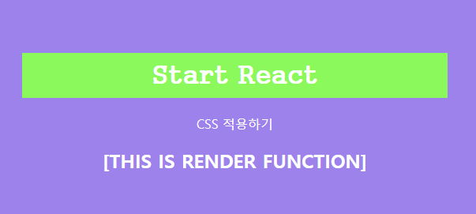

<br/><br/>

### (5) 생명주기 함수 constructor (props) 사용하기
---
constructor(props) 함수는 생명주기 함수 중 가장 먼저 실행되며, 처음 한 번만 호출된다. component 내부에서 사용되는 변수(state)를 선언하고 부모 객체에서 전달받은 변수(props)를 초기화할 때 사용한다. super() 함수는 가장 위에 호출해야 한다.

<br/>

**R005_LifecycleEx.js**
```js
import React, {Component} from 'react';

class R005_LifeCycleEx extends Component {
    constructor(props) {
        super(props);
        this.state = {};
        console.log('1. constructor Call');
    }

    render() {
        console.log('3, render Call');
        return (
            <h2>[THIS IS CONSTRUCTOR FUNCTION]</h2>
        )
    }
}

export default R005_LifeCycleEx;
```

<br/>

**결과**
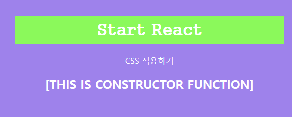

<br/><br/>

### (6) 생명주기 함수 static getDerivedStateFormProps(props, state) 사용하기
---
getDerivedStateFromProps(props, state) 함수는 constructor() 함수 다음으로 실행된다. 컴포넌트가 새로운 props를 받게 됐을 때 state를 변경해준다. App.js에서 전달한 prop_value라는 변수를 props.prop_value로 접근해 값을 가져올 수 있다.

<br/>

크롬 웹 브라우저에서 F12를 눌러 개발자 ㄷ구 창을 띄운 후 [Console] 탭을 클릭하면 출력된 로그를 확인할 수 있다.

<br/>

**App.js**
```js
import React from 'react';
import './App.css';
import LifeCycleEx from './R006_LifecycleEx';

function App() {
  return (
    <div>
      <h1>Start React</h1>
      <p>CSS 적용하기</p>
      <LifeCycleEx
        prop_value = 'FromApp.js'
        />
    </div>
  );
}

export default App;
```

<br/>

**R006_LifecycleEx.js**
```js
import React, { Component } from 'react';

class R006_LifecycleEx extends Component {
  static getDerivedStateFromProps(props, state) {
    console.log('2. getDerivedStateFromProps Call :'+props.prop_value);
    return {};
  }
  constructor(props) {
    super(props);
    this.state = {};
    console.log('1. constructor Call');
  }

  render() {
    console.log('3. render Call');
    return (
      <h2>[ THIS IS CONSTRUCTOR FUCNTION ]</h2>
    )
  }
}

export default R006_LifecycleEx;
```

<br/>

**결과**
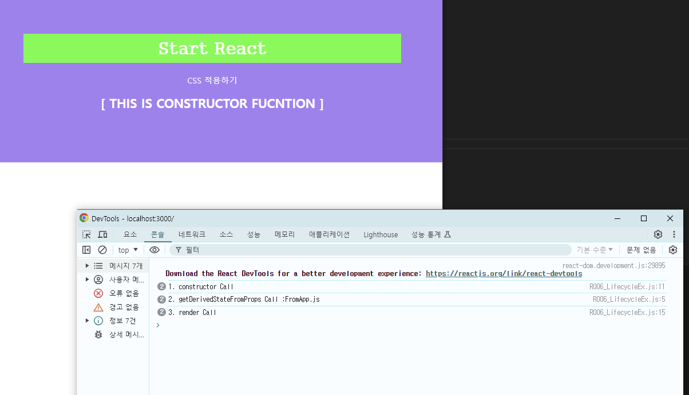

<br/><br/>

### (7) 생명주기 함수 componentDidMount() 사용하기
---
componentDidMount() 함수는 작성한 함수들 중 가장 마지막으로 실행된다. render() 함수가 return 되는 html 형식의 코드를 화면에 그려준 후 실행된다. 화면이 모두 그려진 후에 실행돼야 하는 이벤트 처리, 초기화 등 가장 많이 활용되는 함수다.

<br/>

크롬 웹 브라우저에서 `F12`를 눌러 개발자 도구 창을 띄운 후 [Console] 탭을 클릭하면 출력된 로그를 확인할 수 있다.

<br/>

**R007_LifecycleEx.js**
```js
import React, { Component } from 'react';

class R007_LifecycleEx extends Component {
  static getDerivedStateFromProps(props, state) {
    console.log('2. getDerivedStateFromProps Call :'+props.prop_value);
    return {tmp_state:props.prop_value};
  }

  constructor(props) {
    super(props);
    this.state = {};
    console.log('1. constructor Call');
  }

  componentDidMount() {
    console.log('4. componentDidMount Call');
    console.log('5. tmp_state : '+this.state.tmp_state);
  }

  render() {
    console.log('3. render Call');
    return (
      <h2>[ THIS IS COMPONENTDIDMOUNT FUCNTION ]</h2>
    )
  }
}

export default R007_LifecycleEx;
```

<br/>

**결과**
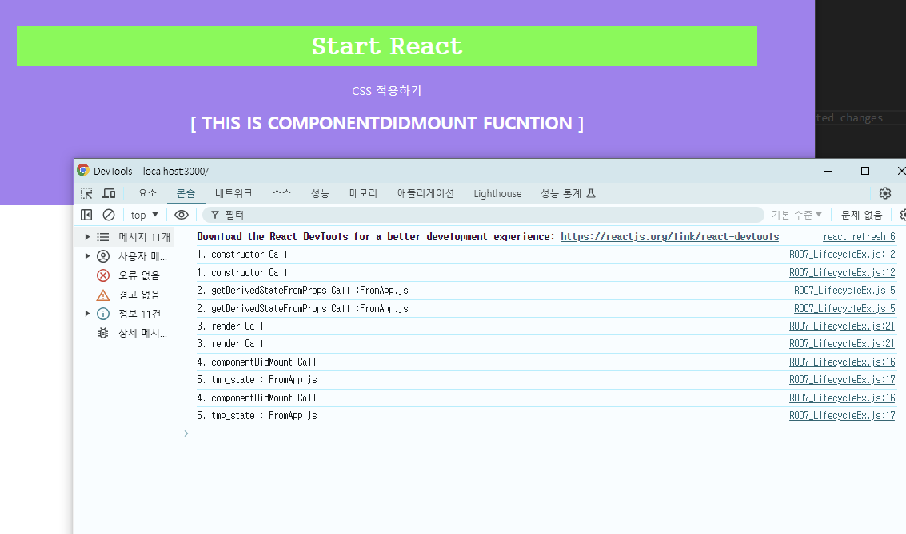

<br/><br/>

### (8) 생명주기 함수 shouldComponentUpdate() 사용하기
---
react에서 생명주기란, component의 생성, 변경, 소멸의 과정을 뜻한다. shouldComponentUpdate() 함수는 component의 '변경' 과정에 속한다. 여기서 '변경'이란, props나 state의 변경을 말한다.

<br/>

**R008_LifecycleEx.js**
```js
import React, { Component } from 'react';

class R008_LifecycleEx extends Component {
  static getDerivedStateFromProps(props, state) {
    console.log('2. getDerivedStateFromProps Call :'+props.prop_value);
    return {tmp_state:props.prop_value};
  }

  constructor(props) {
    super(props);
    this.state = {};
    console.log('1. constructor Call');
  }

  componentDidMount() {
    console.log('4. componentDidMount Call');
    console.log('5. tmp_state : '+this.state.tmp_state);
    this.setState({tmp_state2 : true});
  }

  shouldComponentUpdate(props, state) {
    console.log('6. shouldComponentUpdate Call / tmp_state2 = ' + state.tmp_state2);
    return state.tmp_state2
  }

  render() {
    console.log('3. render Call');
    return (
      <h2>[ THIS IS shouldComponentUpdate FUCNTION ]</h2>
    )
  }
}

export default R008_LifecycleEx;
```

- componentDidMount() 함수는 '생성' 단계의 생명주기 함수 중 가장 마지막으로 실행된다.
- tmp_state2라는 state 변수에 true라는 boolean 유형의 데이터를 세팅했다. setState() 함수는 변수의 선언과 초기화를 동시에 실행한다.
- line 18에서 state의 변경이 발생했기 때문에 '변경' 단계의 생명주기 함수 sholudComponentUpdate()가 실행된다. shouldComponentUpdate()는 boolean 유형의 데이터를 반환하는데, return 값이 true일 경우에 render() 함수를 한 번 더 호출한다.

<br/>

shouldComponentUpdate() 함수의 반환 값에 따라 render() 함수를 재실행할 수 있다는 점을 이용하면, props나 state 변수가 변경될 때 화면을 다시 그리며 제어할 수 있다.

<br/>

**결과**
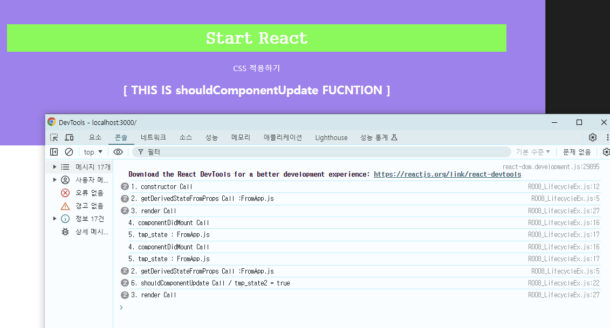

<br/><br/>

### (9) 템플릿 문자열 사용하기
---
ES(ECMA 스크립트)는 표준화된 스크립트 언어이고 ES 뒤에 붙은 숫자는 버전을 의미한다. 2011년부터 사용된 ES5가 웹 표준처럼 사용되고 있다. 2015년 발행된 ES6는 많은 유용한 기능이 추가됐고 자바스크립트는 이 기술 규격을 따른다. react도 자바스크립트 기반의 언어이기 때문에 ES6의 모든 기능을 사용할 수 있다.

<br/>

**App.js**
```js
import React from 'react';
import './App.css';
import Es6 from './R009_Es6';

function App() {
  return (
    <div>
      <h1>Start React</h1>
      <p>CSS 적용하기</p>
      <Es6/>
    </div>
  );
}

export default App;
```

<br/>

**R009_Es6.js**
```js
import React, { Component } from 'react';

class R009_Es6 extends Component {

  constructor(props) {
    super(props);
    this.state = {};
  }

  componentDidMount() {
    var jsString1 = '자바스크립트'
    var jsString2 = '입니다\n다음줄 입니다.'
    console.log(jsString1+' 문자열'+jsString2+'~');
    
    var Es6String1 = 'ES6'
    var Es6String2 = '입니다'
    console.log(`${Es6String1} 문자열${Es6String2}!!
____다음 줄입니다`);

    var LongString = "ES6에추가된String함수들입니다.";
    console.log('startsWith : '+LongString.startsWith("ES6에 추가"));
    console.log('endsWith : '+LongString.endsWith("함수들입니다."));
    console.log('includes : '+LongString.includes("추가된 String"));
  }

  render() {
    return (
      <h2>[ THIS IS ES6 STRING ]</h2>
    )
  }
}

export default R009_Es6;
```
- 기존 자바스크립트에서 줄바꿈을 하려면 개행 문자(\n)을 사용해야 한다.
- 문자열과 변수를 합치기 위해서는 문자열을 작은 따옴표(또는 큰따옴표)로 감싸고 +로 연결해야 한다.
- 따옴표가 아닌 백틱(`)으로 전체 문자열과 변수를 묶어 사용한다. 변수는 ${변수명} 형태로 넣고 코드상에서 줄바꿈을 하면 개행 문자 없이도 사용할 수 있다.
- startsWith(), endsWith(), includes()는 ES6에 추가된 String 함수들이다. startsWith()는 변수 앞에서부터, endsWith()는 뒤에서부터 일치하는 문자열이 있는지 찾는다. includes()는 위치에 상관없이 변수에 특정 문자열이 포함돼 있는지 판단한다. 함수 조건에 부합하면 true, 부합하지 않으면 false를 반환한다.

<br/>

**결과**
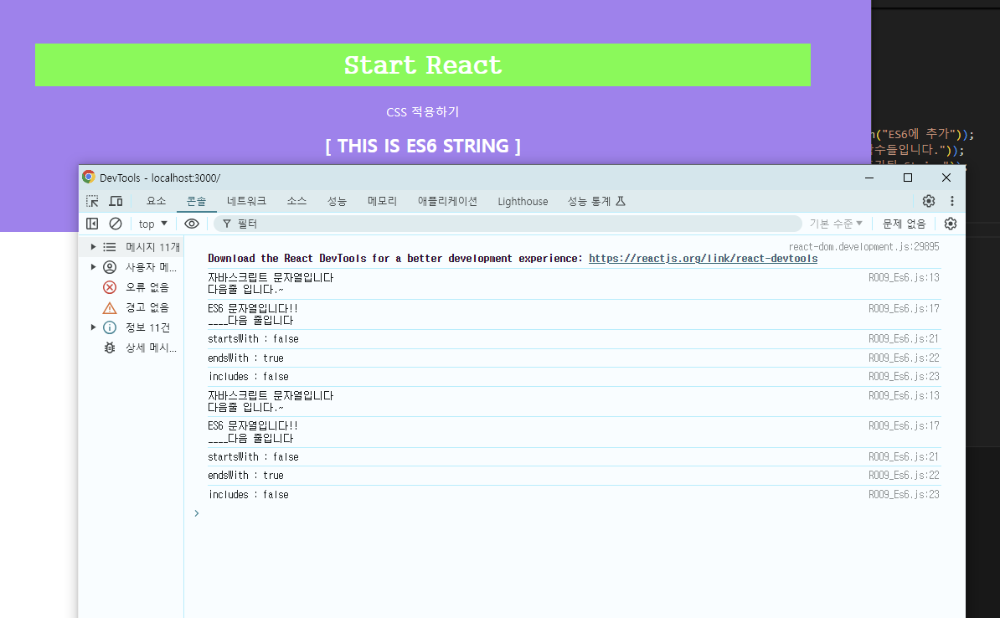

<br/><br/>

### (10) var, let, const 사용하기
---
ES5에서 사용하던 var는 유연한 방식으로 변수를 재선언, 재할당할 수 있다. 이런 특징으로 인해 변수의 사용 범위가 불확실해지거나 의도하지 않은 변숫값 변경이 발생할 수 있다. 이러한 var의 단점을 보완하기 위해 ES6에서 let와 const가 추가됐다.

<br/>

**App.js**
```js
import React from 'react';
import './App.css';
import Variable from './R010_Variable';

function App() {
  return (
    <div>
      <h1>Start React</h1>
      <p>CSS 적용하기</p>
      <Variable/>
    </div>
  );
}

export default App;
```

<br/>

**R010_Variable.js**
```js
import React, { Component } from 'react';

class R010_Variable extends Component {

  constructor(props) {
    super(props);
    this.state = {};
  }

  componentDidMount() {
    var varName = 'react'
    console.log('varName1 : '+varName)
    var varName = '200' // 'varName' is already defined  no-redeclare
    console.log('varName2 : '+varName)

    let letName = 'react'
    console.log('letName1 : '+letName)
    // let letName = '200' // Parsing error: Identifier 'letName' has already been declared
    letName = 'react200'
    console.log('letName2 : '+letName)

    const constName = 'react'
    console.log('constName : ' + constName)
    // const constName = '200' // Parsing error: Identifier 'constName' has already been declared
    // constName = 'react200' // Uncaught TypeError: Assignment to constant variable.
  }

  render() {
    return (
      <h2>[ THIS IS Variable ]</h2>
    )
  }
}

export default R010_Variable;
```

- 이미 선언한 var 변수 varName을 다시 선언했을 때 'varName' is already defined no-redeclare라는 경고 메시지가 콘솔 로그에 출력된다. 하지만 var 변수는 재선언, 재할당을 허용하기 때문에 경고 메시지가 출력돼도 페이지가 정상적으로 표시된다.
- 이미 선언한 let 변수 letName을 다시 선언했을 때 Parsing error: Identifier 'letName' has already been declared라는 에러 메시지가 콘솔 로그에 출력된다. let 변수는 재선언을 허용하지 않기 때문에 에러 페이지가 표시된다.
- let 변수는 재할다을 허용한다. 이미 선언한 let 변수 letName에 새로운 값을 할당했을 때 페이지가 정상적으로 표시된다. 
- 이미 선언한 const 변수의 constName을 다시 선언했을 때 Parsing error: Idenfifier 'constName' has already been declared라는 에러 메시지가 콘솔 로그에 출력된다. const 변수는 재선언을 허용하지 않기 때문에 에러 페이지가 표시된다.

<br/>

**결과**
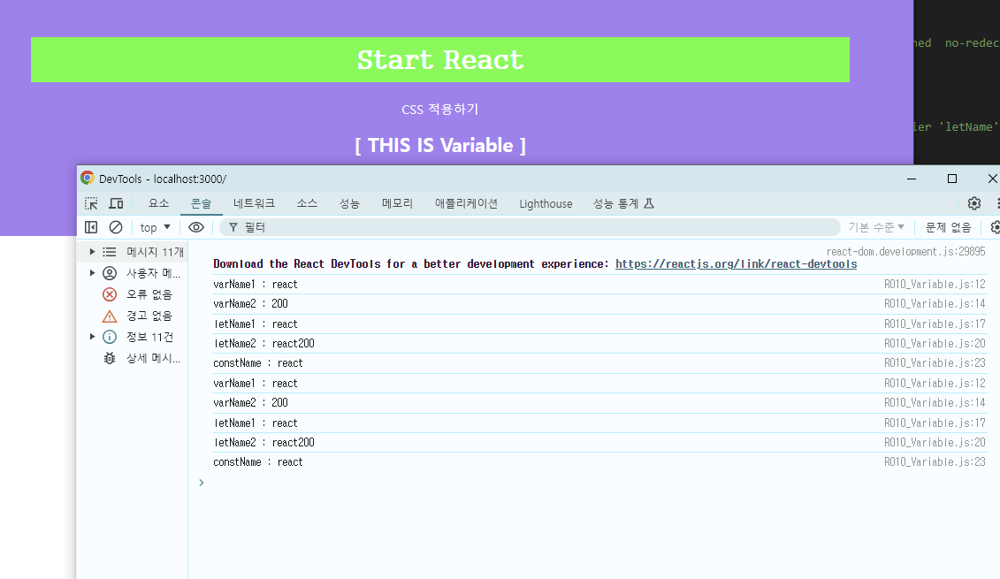

<br/><br/>

### (11) 전개 연산자 사용하기
---
전개 연산자는 배열이나 객체 변수를 좀 더 직관적이고 편리하게 합치거나 추출할 수 있게 도와주는 문법이다. 변수 앞에 ...(마침표 3개)를 입력해 사용한다.

<br/>

**App.js**
```js
import React from 'react';
import './App.css';
import SpreadOperator from './R011_SpreadOperator';

function App() {
  return (
    <div>
      <h1>Start React</h1>
      <p>CSS 적용하기</p>
      <SpreadOperator/>
    </div>
  );
}

export default App;
```

<br/>

**R011_SpreadOperator.js**
```js
import React, { Component } from 'react';

class R011_SpreadOperator extends Component {

  constructor(props) {
    super(props);
    this.state = {};
  }

  componentDidMount() {
    //javascript Array
    var varArray1 = ['num1', 'num2'];
    var varArray2 = ['num3', 'num4'];
    var sumVarArr = [varArray1[0], varArray1[1], varArray2[0], varArray2[1]];
    // var sumVarArr = [].concat(varArray1, varArray2);
    console.log('1. sumVarArr : '+sumVarArr)
    //ES6 Array
    let sumLetArr = [...varArray1, ...varArray2];
    console.log('2. sumLetArr : '+sumLetArr)
    const [ sum1, sum2, ...remain] = sumLetArr;
    console.log('3. sum1 : '+sum1+', sum2 : '+sum2+ ', remain : '+remain)

    var varObj1 = { key1 : 'val1', key2 : 'val2' }
    var varObj2 = { key2 : 'new2', key3 : 'val3' }
    //javascript Object
    var sumVarObj = Object.assign({}, varObj1, varObj2)
    console.log('4. sumVarObj : '+JSON.stringify(sumVarObj))
    //ES6 Object
    var sumLetObj = {...varObj1, ...varObj2}
    console.log('5. sumLetObj : '+JSON.stringify(sumLetObj))
    var {key1, key3, ...others} = sumLetObj;
    console.log('6. key1 : '+key1+', key3 : '+key3+', others : '+JSON.stringify(others));
  }

  render() {
    return (
      <h2>[ THIS IS SpreadOperator ]</h2>
    )
  }
}

export default R011_SpreadOperator;
```
- 기존 ES5에서 배열 2개를 합치기 위해서는 배열 각각에 인덱스로 접근해 값을 가져오거나 concat 함수를 이용한다. varArray1, varArray2 배열에 각각 인덱스(0, 1)로 접근해 인자 값(num1, num2, num3, num4)을 가져와 새로운 배열 sumVarArr에 하나씩 넣는다.
- ES6에서는 전개 연산자 ...(마침표 3개)을 배열명 앞에 붙여 여러 개의 배열을 합칠 수 있다.
- sumLetArr 배열의 값을 추출해 개별 변수에 넣는다. 순서대로 변수 sum1에 sumLetArr[0] 값, sum2에 sumLetArr[1] 값을 대입한다. 나머지 배열 값은 마지막에 전개 연산자 처리된 ...remain 변수에 넣는다.
- 기존 ES5에서 객체 2개를 합치기 위해서는 **Object.assign()** 함수를 이용해야 한다. 첫 번째 인자 {}는 함수의 return 값이고 뒤의 인자에 객체들을 ,(콤마)로 연결해 나열하면 여러 개의 객체를 합칠 수 있다.
- ES6에서는 ...(마침표 3개)을 객체명 앞에 붙여 여러 개의 객체를 합칠 수 있다.
- sumLetObj 객체의 키와 값을 추출해 키와 동일한 명칭의 개별 변수에 넣는다. 나머지는 마지막에 전개 연산자 처리된 ...others 변수에 넣는다.

<br/>

**결과**
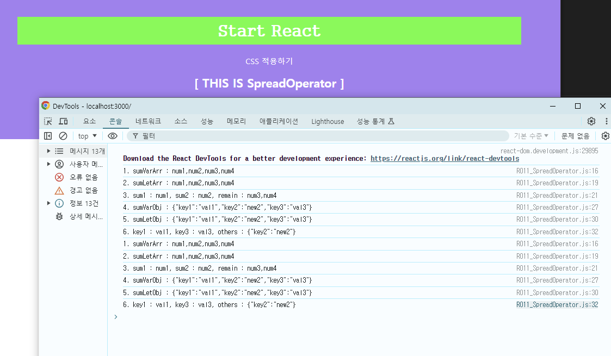

<br/><br/>

### (12) class 사용하기 
---
기존 ES5 자바스크립트에서는 객체를 구현하기 위해 prototype을 사용한다. 객체는 상속을 통해 코드를 재사용할 수 있게 해준다. ES6에서 등장한 class는 prototype과 같은 개념인데, 쉽게 읽고 표현하기 위해 고안된 문법이다.

<br/>

**R012_Class&Prototype.js**
```js
import React, { Component } from 'react';

class ClassPrototype extends Component {

  constructor(props) {
    super(props);
    this.state = {};
  }

  componentDidMount() {
    //ES5 prototype
    var ExamCountFunc = (function () {
      function ExamCount(num) {
        this.number = num;
      }
      ExamCount.prototype.showNum = function () {
        console.log('1. react_' + this.number);
      };
      return ExamCount;
    }());
    
    var cnt = new ExamCountFunc('200');
    cnt.showNum();

    //ES6 class
    class ExamCountClass {
      constructor(num2) {
        this.number2 = num2;
      }
      showNum() {
        console.log(`2. react_${this.number2}`);
      }
    }
    
    var cnt2 = new ExamCountClass('2hundred');
    cnt2.showNum();
  }

  render() {
    return (
      <h2>[ THIS IS Class ]</h2>
    )
  }
}

export default ClassPrototype;
```

- 자바스크립트에서는 함수를 객체로 사용할 수 있다.

<br/>

**결과**


<br/><br/>

### (13) 화살표 함수 사용하기
---
기존 ES6에서 등장한 화살표 함수는 'function' 대신 '=>' 문자열을 사용하며 'return' 문자열을 생략할 수도 있다. 따라서 기존 ES5 함수보다 간략하게 선언할 수 있다. 또 화살표 함수에서는 콜백 함수에서 this를 bind 해야 하는 문제도 발생하지 않는다.

<br/>

**R013_ArrowFunction.js**
```js
import React, { Component } from 'react';

class R013_ArrowFunction extends Component {

  constructor(props) {
    super(props);
    this.state = {
      arrowFuc: 'React200',
      num: 3
    };
  }

  componentDidMount() {
    Function1(1);
    this.Function2(1,1);
    this.Function3();
    this.Function4();
    this.Function5(0,2,3);

    function Function1(num1) {
      return console.log(num1+'. Es5 Function');
    }
  }
  
  Function2 = (num1, num2) => {
    let num3 = num1 + num2;
    console.log(num3+'. Arrow Function : '+this.state.arrowFuc);
  }
  
  Function3() {
    var this_bind = this;
    setTimeout(function() {
      console.log(this_bind.state.num+'. Es5 Callback Function noBind : ');
      console.log(this.state.arrowFuc);
    },100);
  }
  
  Function4() {
    setTimeout(function() {
      console.log('4. Es5 Callback Function Bind : '+this.state.arrowFuc);
    }.bind(this),100);
  }
  
  Function5 = (num1, num2, num3) => {
    const num4 =  num1 + num2 + num3;
    setTimeout(() => {
      console.log(num4+'. Arrow Callback Function : '+this.state.arrowFuc);
    }, 100);
  }

  render() {
    return (
      <h2>[ THIS IS ArrowFunction ]</h2>
    )
  }
}

export default R013_ArrowFunction;
```

<br/>

**결과**


<br/><br/>

### (14) forEach() 함수 사용하기
---
배열 함수 forEach()는 for문에서 사용하던 순번과 배열의 크기 변수를 사용하지 않는다. 배열의 처음부터 마지막 순번까지 모두 작업하는 경우 forEach()문을 사용하는 것이 간편하다. 하지만 특정 순번에서만 배열 값을 사용하거나 변경해야 하는 상황이라면 for문을 사용해야 한다.

<br/>

**R014_ForEach.js**

```js
import React, { Component } from 'react';

class R014_ForEach extends Component {

  componentDidMount() {
    var Es5_Arr = [ 3, 2, 8, 8 ]
    var Es5_newArr = []
    
    for (var i = 0; i < Es5_Arr.length; i++) {
      Es5_newArr.push(Es5_Arr[i])
    }
    console.log("1. Es5_newArr : ["+Es5_newArr+"]")

    var Es6_Arr = [ 3, 3, 9, 8 ]
    var Es6_newArr = []
    Es6_Arr.forEach((result) => {
      Es6_newArr.push(result)
    })
    console.log("2. Es6_newArr : ["+Es6_newArr+"]")
  }

  render() {
    return (
      <h2>[ THIS IS ForEach ]</h2>
    )
  }
}

export default R014_ForEach;
```
- for문에서는 순번 변수(i)와 배열의 크기(For_arr.length)가 필요하다. 순번을 0부터 1씩 증가시킨다. 배열의 크기보다 1이 작은 값이 될 떄까지 새로운 함수(For_newArr)에 기존 함수 값을 넣는다(push).
- forEach 함수에서는 순번과 배열의 크기 정보를 사용하지 않는다. 0부터 배열의 크기만큼 반복하며 순서대로 배열 값을 반환한다. 반복문이 실행될 떄마다 콜백 함수로 결괏값(result)을 받아 새로운 함수(ForEach_newArr)에 넣는다.

<br/>

**결과**
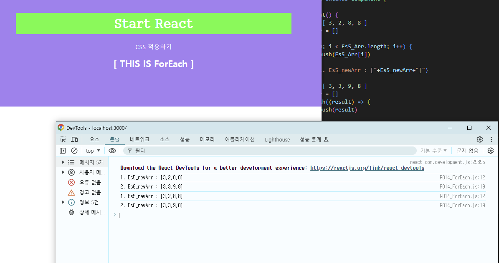
<br/><br/>

### (15) map() 함수 사용하기
---
배열 함수 map()은 forEach()와 마찬가지로 for문에서 사용하던 순번과 배열의 크기 변수를 사용하지 않는다. 차이점은 map()은 forEach()와 달리 return을 사용해 반환 값을 받을 수 있다는 것이다.

<br/>

**R015_Map.js**
```js
import React, { Component } from 'react';

class R015_Map extends Component {

  componentDidMount() {
    var Map_Arr = [ 3, 2, 8, 8 ]
    let Map_newArr = Map_Arr.map(x => x)
    console.log("1. Map_newArr : ["+Map_newArr+"]")

    let Map_mulitiArr = Map_Arr.map(x => x * 2)
    console.log("2. Map_mulitiArr : ["+Map_mulitiArr+"]")

    var ObjArray = [{key:'react', value:'200'},
                    {key:'리액트', value:'TwoHundred'}];
    let Map_objArr = ObjArray.map((obj, index) => {
      console.log((index+3)+". obj : "+JSON.stringify(obj))
      var Obj = {};
      Obj[obj.key] = obj.value;
      return Obj;
    });
    console.log("5. Map_objArr : "+JSON.stringify(Map_objArr))
  }

  render() {
    return (
      <h2>[ THIS IS Map ]</h2>
    )
  }
}

export default R015_Map;
```

<br/>

**결과**
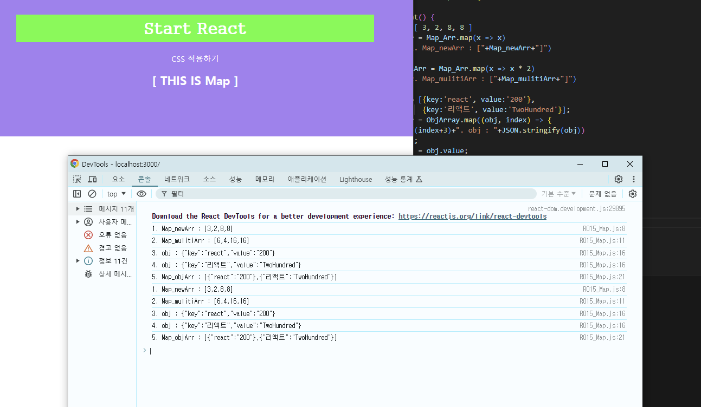

<br/><br/>

### (16) jquery 사용하기
---
jquery는 가장 인기 있는 자바스크립트 라이브러리다. 이벤트 처리, 애니메이션 등 자바스크립트의 기능을 간단하고 빠르게 구현할 수 있도록 지원해준다.

<br/>

jquery를 사용하기 위해 cmd 창을 열어 client 폴더 경로로 이동한다. `npm install jquery`를 입력하면 npm이 jquery를 설치한다.

<br/>

**R016_Jquery.js**
```js
import React, { Component } from 'react';
import $ from 'jquery';

class R016_Jquery extends Component {

  input_alert = (e) => {
    var input_val = $('#inputId').val();
    alert(input_val);
  }

  render() {
    return (
      <div>
        <h2>[ THIS IS Jquery ]</h2>
        <input id="inputId" name="inputName"/>
        <button id="buttonId" onClick={e => this.input_alert(e)}>Jquery Button</button>
      </div>
    )
  }
}

export default R016_Jquery;
```

<br/>

**결과**
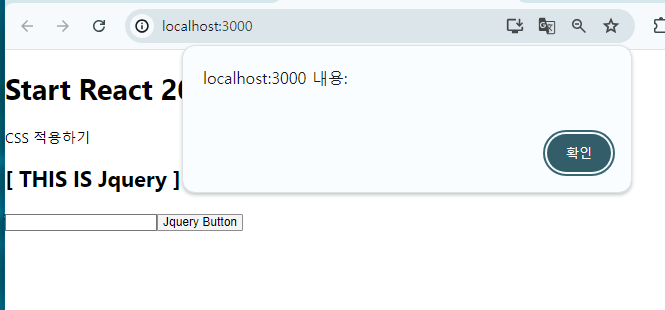

<br/><br/>
